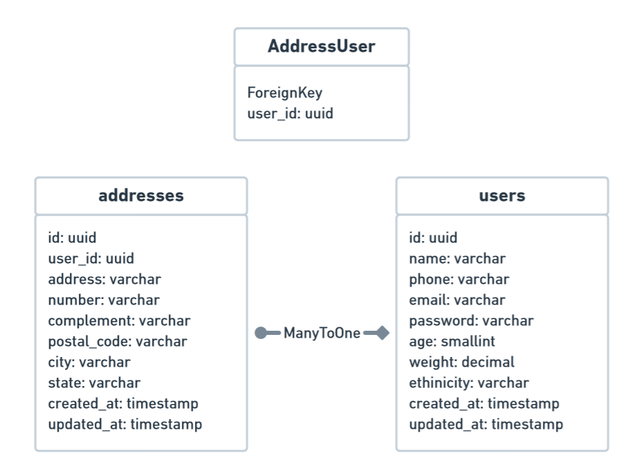

# Projeto Backend CRUD em TypeScript & Node.JS ⚙

[](https://www.typescriptlang.org/) [](https://nodejs.org/en/)

Simples CRUD de Users e Addresses aplicando as técnologias Node.JS, TypeScript, TypeORM, TSyringe, Jest, Express, JWT e BCrypt.

Além disso na construção do projeto foram aplicados os conceitos de SOLID, DDD e TDD.

## Após clonar o repositório instale as dependências

Execute o seguinte comando no terminal para instalar todas as dependências:

```bash
yarn
```

## Criação do Banco de Dados com Docker 🐳

Execute o seguinte comando no terminal para criar uma imagem com o banco de dados PostgreSQL:

```bash
docker-compose -f docker-compose.yml up -d
```

> Após a execução a imagem desafio-backend-typescript será gerada no seu Docker

## Criando a estrutura básica do Banco de Dados 🐘

Para criar as tabelas no banco de dados, execute o seguinte comando:

```bash
yarn typeorm migration:run
```

## Estrutura do Banco 🗃



## Entendendo a estrutura de pastas 🗂

    ├── .github
    ├── src            # Arquivos de Recursos da aplicação
    │   ├── @types     # Configurações de tipos para o TypeScript
    │   ├── config     # Arquivos de configurações específicas da aplicação
    │   ├── modules    # Módulos da aplicação
    │   └── shared     # Pasta com os recursos compartilhados entre os domínios
    └── ...

### Pasta de Modules 📁

    ├── ...
    ├── modules        # Módulos da aplicação
    │   ├── addresses  # Módulo de Endereços/entidade addresses
    │   ├── users      # Módulo de Usuários/entidade users
    └── ...

### Dentro de um módulo 📁

    ├── ...
    ├── users             # Módulo de Usuários/entidade users
    │   ├── dtos          # Pasta onde ficam os Data Transfer Objects
    │   ├── infra         # Infra específico do módulo
    │   ├── providers     # Provider específico do módulo (Ex: HashProvider)
    │   ├── repositories  # Repositórios do usuário incluindo o Fake para o TDD
    │   └── services      # Services com as regras de negócio do domínio e testes unitários
    └── ...

### Dentro da pasta infra 📁

```
├── ...
├── infra                 # Infra específico do módulo
│   ├── http              # Recursos HTTP do domínio
│   │   ├── controllers   # Controllers das requisições das rotas
│   │   ├── middlewares   # Middlewares de controlers (Ex: EnsureAuthenticated)
│   │   └── routes        # Rotas de users
│   └─── typeorm          # Recursos isolados do TypeORM
│       ├── entities      # Models/entidades do domínio específicas do TypeORM
│       └── repositories  # Repositórios isolados com os métodos do TypeORM
└── ...
```

### Dentro da pasta shared 📁

```
├── ...
├── shared         # Shared recursos compartilhados entre os domínios
│   ├── container     # Container com as injeções de dependências dos repositórios
│   ├── errors        # Configuração de mensagens de erros retornadas
│   └── infra         # Recursos isolados do TypeORM
│       ├── http          # Configurações HTTP da aplicação routes/server
│       └── typeorm       # Recursos compartilhados do TypeORM
│           └── migrations   # Migrations para a criação das tableas no BD
└── ...
```

## Configuração do arquivo DOTENV

Renomeie o arquivo **.env.exemple** para **_.env_**.

Em seguida gere um hash pelo [](https://www.md5hashgenerator.com/)

Agora cole o hash gerado na configuração de APP_SECRET no arquivo **.env**:

```
APP_SECRET=#MD5 hash
```

# Executando os testes 🧪

Para os testes unitários execute o seguinte comando:

```bash
yarn test
```

# Executando o projeto ▶

Para executar o servidor rode o seguinte comando:

```bash
yarn dev:server
```

> Se estiver tudo ok aparecerá a seguinte mensagem no terminal: Back-end started on port 3333! 🚀

# Documentação das rotas da API com Postman 🐱‍🚀

Acesse a este que com a documentação das rotas e é possível testálas pelo próprio Postman: [](http://tinyurl.com/back-end-documentation)

Habilite o **Enviroment _dev_** no canto superior direito, onde está escrito **No Enviroment**.

Nele já estão configuradas as variáveis de ambiente como a base_url e o token para a autenticação nas rotas, o último será obtido após a criação da sessão.

**_OBS:_**Todo o envio de dados será feito por um arquivo JSON através do Body da requisição.

# Para começar a usar as Rotas:

Primeiro **crie** um usuário, acessando a rota **Create User** dentro de **Users**, já há um usuário **John Doe** definido no Body da requisição, então é só enviar:

**POST** Create User

> /users

## Sessions 👨‍💻

**POST** Create a Session:

Em seguida obtenha o **Token JWT** para a configuração do **Enviroment** criando uma sessão:

> /sessions

## IMPORTANTE ‼

Copie e cole o **Token** obtido no **Enviroment _dev_** na variável **token**, é importante que você faça isso porque TODAS as rotas EXCETO a rota Create User fazem o uso da autenticação por JWT.

# Users 👨‍💻

**POST** Create User:

Cria um usuário, já há um User **John Doe** definido no Body da requisição.

/users

**GET** Show User:

Mostra os dados do usuário, é necessário passar o ID do usuário pelas Path Variables do request.

> /users/user/:user_id

**GET** List All Users:

Lista todos os usuários cadastrados:

> /users/

**GET** List All Addresses From User:
A rota mostra todos os endereços de um usuário, ela filtrará pelo ID do usuário enviado no Path Variables.

> /users/user/addresses/:user_id

**PUT** Update User Profile:

Nesta rota é possível fazer a atualização nos dados do usuário que está **autenticado** no momento, então não é preciso enviar nenhuma Path Variable, e **somente** através desta rota é possível realizar a **TROCA DE SENHA** informando a **old_password** e a troca de senha é opcional:

> /users/profile/

**PUT** Update User:

Nesta rota é possível fazer a atualização nos dados do usuário, pelo ID informado no Path Variables.

> /users/user/:user_id

**DELETE** Delete User:

Nesta rota é possível deletar um usuário, pelo ID informado no Path Variables.

> /users/user/:user_id

# Addresses 🏠

**POST** Create Address:

Crie um endereço a partir do ID do usuário informado nas Path Variables do request.

> /addresses/:user_id

**GET** List All Addresses:

Lista todos os endereços cadastrados.

> /addresses/

**GET** Show Address:

Mostra os dados de um endereço, é necessário passar o ID do endereço nas Path Variables do request.

> /addresses/address/:address_id

**PUT** Update Address:

Nesta rota é possível fazer a atualização dos dados de um endereço, pelo ID informado nas Path Variables.

> /addresses/address/:address_id

**DELETE** Delete Address:

Nesta rota é possível deletar um endereço, pelo ID informado nas Path Variables.

> /addresses/address/:address_id
